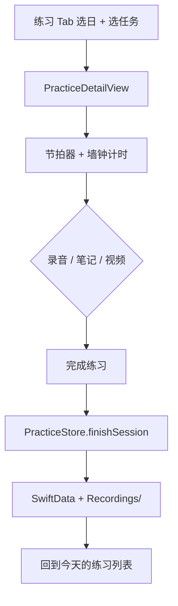

# Gita（foxgita）技术开发文档

> 版本：与当前主干一致（Schema V7 / Store + Repository / 橙色设计系统 v2）  
> 平台：iOS 18+ · SwiftUI · SwiftData · AVFoundation  
> 范围：本地优先的 P0 MVP；数据层已为云同步预留字段，当前无远程后端  
> 近期增量：首页按日锁定练习、左滑编辑/删除、训练页录音中面板、系统相机录视频、录像 AI 分段诊断、录像来源选择与相册导入

---

## 1. 产品与技术目标

Gita 是一款吉他练习陪伴 App：引导用户「今天只练一点点」，用节拍器 + 计时 + 录音/笔记/视频完成一次练习，并把结果沉淀到记录与历史统计里。

技术目标：

| 目标 | 做法 |
|---|---|
| 本地可用、零账号 | SwiftData + Documents，无网络依赖 |
| 练琴核心体验稳定 | 采样帧节拍器、墙钟计时、统一音频会话 |
| 按日组织练习 | 周历选日 + 今日可练 / 过去只读 / 未来锁定 |
| 可演进到云同步 | `syncState` / 软删 / Repository 抽象 |
| 可测、可回归 | Swift Testing 单元测试 + XCTest UI 冒烟 |

---

## 2. 技术栈与工程约束

| 层 | 选型 |
|---|---|
| UI | SwiftUI，`@Observable` / `@Query` / `@Environment` |
| 持久化 | SwiftData（`VersionedSchema` + `SchemaMigrationPlan`） |
| 音频 / 视频 | AVAudioEngine / AVAudioPlayerNode / AVAudioRecorder / `UIImagePickerController`（摄像） |
| 通知 | UserNotifications（每日提醒 + 深链） |
| 图表 | Swift Charts |
| 本地化 | String Catalog（`Localizable.xcstrings`），源语言 `zh-Hans` |
| 测试 | Swift Testing（unit）+ XCTest（UI） |
| 最低系统 | iOS 18.0 |
| 设备 | iPhone 竖屏；iPad 走兼容模式 |

工程关键信息：

- Bundle ID：`com.haizei.foxgita`
- Scheme：`foxgita`（含 `foxgitaTests` / `foxgitaUITests`）
- 麦克风用途文案：`INFOPLIST_KEY_NSMicrophoneUsageDescription`
- 相机用途文案：`INFOPLIST_KEY_NSCameraUsageDescription`
- 方向：`UISupportedInterfaceOrientations_iPhone = Portrait`

---

## 3. 目录结构

```
foxgita/
├── foxgitaApp.swift          # 入口：ModelContainer / Store / 主题
├── ContentView.swift
├── App/
│   ├── AppRouter.swift       # Tab + 导航路径 + 提醒深链标志
│   └── MainTabView.swift
├── Features/
│   ├── Practice/             # 周历练习首页 / 详情 / 推荐 / 编辑 Sheet
│   ├── Record/               # 练习记录列表与详情
│   ├── History/              # 月历 + 统计
│   └── Settings/             # 提醒 / 外观 / 清数据 / AI 记忆 / 首次授权 Sheet
├── Components/SharedUI.swift # StreakCard / TaskRowCard / DaySessionCard 等
├── Models/
│   ├── Models.swift          # Schema V3–V5 + MigrationPlan（V2–V7）
│   ├── SchemaV2.swift
│   ├── SchemaV6.swift        # LocalProfile / MemoryItem / profileId
│   └── SchemaV7.swift        # memoryConsentState；当前容器版本
├── Services/                 # 业务与基础设施（见 §5、§6）
│   ├── PracticeStore.swift
│   ├── AudioRecorderService.swift
│   ├── VideoRecorderService.swift   # 系统相机录视频
│   ├── AlbumDurationGate.swift      # 相册时长门 [30, 600] 秒
│   ├── AlbumVideoImporter.swift     # 相册拷进 Recordings
│   ├── RecordingStore.swift         # m4a / mov 文件与孤儿 GC
│   ├── MemoryRepository.swift       # 显式 profileId 的 fetch；用户 CRUD
│   ├── MemoryContextProviding.swift # LiveMemoryContext / EmptyMemoryContext
│   ├── TaskMemorySync.swift         # custom-* 任务标题 → goal
│   ├── MemoryStore.swift            # 同意状态 + 用户记忆 CRUD
│   ├── MemoryConsentState.swift     # 三态 + 隐私文案
│   ├── MemoryConsentCoordinator.swift # 首次生成授权门
│   ├── MemoryDebugSeeder.swift      # DEBUG 种子；Release 不含
│   └── …
├── Theme/                    # 颜色 / 字体 / 外观 / 触感
├── Assets.xcassets/Colors/   # 23 个 light/dark Color Set
└── Localizable.xcstrings

foxgitaTests/                 # 单元与迁移测试
foxgitaUITests/               # 主流程冒烟
```

分层约定：

- **View**：只负责展示与意图（按钮、表单）；读用 `@Query`，写只调 `PracticeStore`。
- **Store**：业务不变量与错误映射。
- **Repository**：持久化细节；未来可套同步装饰器。
- **Services**：音频、视频、计时、媒体文件、统计纯函数、提醒调度、记忆 CRUD 与授权。
- **Theme**：设计 token，不放业务逻辑。

---

## 4. 前端方案

### 4.1 用户操作主闭环



关键交互细节：

| 场景 | 行为 |
|---|---|
| 周历选日 | `StreakCard` 展示大日期数字；`selectedDay` 驱动列表内容（见 §4.1.1） |
| 左滑练习行 | 今日列表：`swipeActions` → 编辑 Sheet / 软删确认 |
| 推荐 Sheet 选任务 | 只回传 `taskId`；用 `pendingTaskId` + `.sheet(onDismiss:)` 导航，避免 dismiss 时序 hack |
| 计时中返回 | `confirmationDialog` 二次确认，避免误丢本次记录 |
| 录音中 | 工具按钮显示「录音中」+ 粉色「正在录音」面板（计时 / 暂停 / 停止） |
| 录视频 | 第 2 次点打开来源页；现场录像仍 `presentCamera()`；相册经预览确认后拷进 Recordings 再 `persist` |
| 完成练习 | 成功触感 + 回到今天的练习列表 |
| 提醒通知点击 | `ReminderDelegate` → `router.openTodayFirstPractice` → 切到练习 Tab、清空导航栈并复位到今天；今日有任务则打开第一项，空则停留空 inbox，不打开昨日任务 |
| 音频打断（来电等） | `AudioSessionCoordinator` 回调：停节拍器、暂停计时、停录音 |

#### 4.1.1 首页按日锁定（PracticeView）

| 选中日 | 列表内容 | FAB 添加 | 左滑编辑/删除 | 进入详情 |
|---|---|---|---|---|
| **今天** | `isVisibleToday`：`startedOn` 与设备当前自然日相同，且 `status == .active`、用户加入的 `custom-*` / `active-*`、非模板、未删除 | 显示 | 有 | 「开始」→ 详情 |
| **过去** | 当天有效 session 按 `taskId` 聚合（`DayTaskGroup`） | 隐藏 | 无 | 「查看」→ 练习详情（新记录记今天） |
| **未来** | 空态「这一天还没到」 | 隐藏 | 无 | 不可练 |

今日列表按读时过滤，不在午夜或启动时删除昨日任务。空态文案：「今天还没加练习」。首页无「本周节奏 / 当周节奏」卡；连续练习卡与记录 Tab 仍在。跨午夜仅当选中日本来是「当时的今天」时拨到新的今天。

有效记录：`durationSec > 0`，或笔记非空，或至少一条录音/视频。空完成不落库、不点亮周历。

数据来源：`StatsAggregator.weekDays(from:)` 提供周一～周日的 `WeekDay`（星期标签、日号、是否今天/未来、是否已练）。

#### 4.1.2 训练页工具区（PracticeDetailView）

| 工具 | 图标 | 行为 |
|---|---|---|
| 录音 | `mic` / `mic.fill` | 切换录制；录制中展示 ActivePanel（`elapsedDisplay`、暂停/继续、停止） |
| 写笔记 | `square.and.pencil` | 展开笔记输入 |
| 录视频 | `video.fill` | 第 1 次切视频模式；第 2 次打开 `VideoSourceView`。现场录像仍 `presentCamera()`；相册预览确认后 `AlbumVideoImporter` 拷贝再 `persist`。模拟器无相机时 Toast |

完成时：`recorder.consume()` + `video.takeAll()` 合并为 `[AudioRecorderService.Clip]` 交给 `finishSession`。离开详情未完成则丢弃 audio/video pending 并删文件。

列表展示该 `taskId` 下全部未删除 recording；`openSessionId` 只用于写入。

### 4.2 数据交互（读 / 写分工）

**读路径（保留 `@Query`）**

SwiftData 的 `@Query` 会自动驱动视图刷新。视图侧用 `#Predicate` 收窄范围，禁止「拉全表再 `.first`」：

```swift
// PracticeDetailView
Query(filter: #Predicate<TaskItem> { $0.id == taskId && $0.deletedAt == nil })

// RecordDetailView
Query(filter: #Predicate<PracticeSession> { $0.taskId == taskId }, sort: \.endedAt, order: .reverse)
```

**写路径（一律经 Store）**

视图内不得出现 `modelContext.insert` / `save`。命令入口见 §6.3。

**跨页面传参铁律**

只传 `String` id，不传 `@Model` 实例，避免 sheet / 异步边界上的对象所有权问题。

### 4.3 页面跳转

`AppRouter`（`@Observable`）集中导航状态：

| 状态 | 含义 |
|---|---|
| `selectedTab` | 当前 Tab |
| `practicePath` / `recordPath` | 各 Tab 独立 `NavigationPath` |
| `openTodayFirstPractice` | 提醒深链一次性消费标志 |

四个 Tab：练习 · 记录 · 历史 · 设置。详情页隐藏 TabBar。

### 4.4 主题与视觉

- 颜色：`Assets.xcassets/Colors/*` 提供 Any + Dark 两套外观；`GitaTheme` 通过 `Color(.brandPrimary)` 等符号引用。
- 外观：`AppAppearance`（`system` / `light` / `dark`）存 `@AppStorage("gita.appearance")`，仅在根视图 `.preferredColorScheme` 应用一次。
- 字体：`GitaFont` 基于 `UIFontMetrics`，随 Dynamic Type 缩放。
- 触感：`Haptics.success` / `tap` / `downbeat`（节拍强拍）。

### 4.5 设备适配

- iPhone 仅竖屏。
- 组件优先 `minHeight` + 自适应宽度，避免写死 `height: 82` 一类常量。
- 验收断点：SE（375）/ 标准（约 393）/ Pro Max（约 440）；浅色与深色均需可读。

---

## 5. 音频与计时子系统

### 5.1 AudioSessionCoordinator

单一入口协商 `AVAudioSession`：

- 有录音需求 → 保持 `.playAndRecord`
- 仅播放（节拍器 / 回放）→ `.playback`，且不得在录音中降级
- 监听 `AVAudioSession.interruptionNotification`，打断时回调上层暂停

修复的历史问题：先录音再开节拍器时，节拍器把 category 切回 `.playback` 导致录音中断。

### 5.2 MetronomeEngine

采样帧预排：

1. 预烘焙「重音 / 轻音」两个 `AVAudioPCMBuffer`
2. 按 `AVAudioTime(sampleTime:atRate:)` 把未来约 150ms 内的拍点入队
3. 约每 50ms 补排一次；后台恢复时若下一拍已过期则重新锚定，避免连发补拍
4. 强拍另触发 `Haptics.downbeat`

暂停会 `player.stop()` 并 `release(.playback)`（可能 `setActive(false)`）。再次 `start()` 不得只看自维护标志；必须在 acquire 之后确认 `engine.isRunning`，否则 `try engine.start()`。Graph（attach / connect / click buffer）只建一次，stop 不 `engine.stop()`、不拆节点。`start()` 失败时 `isPlaying` 保持 false，并 release 本次 playback need。

### 5.3 PracticeTimer

墙钟计时：`startedAt` + 已累计区间；Timer 只刷新 UI。时钟可注入（`init(now:)`），便于单测推进时间。锁屏或切后台回来，时长仍正确。

### 5.4 AudioRecorderService + RecordingStore

| 职责 | 位置 |
|---|---|
| 麦克风权限、录制、暂停/继续、elapsed、pending | `AudioRecorderService` |
| 文件目录、命名、时长、`fileExists(fileName:)`、孤儿 GC、旧路径迁移 | `RecordingStore` |

公开状态（供训练页 UI）：`isRecording` / `isPaused` / `elapsedSec` / `elapsedDisplay` / `pending` / `lastError`。

文件落在 `Documents/Recordings/`。库内只存相对文件名；URL 运行时拼接（沙盒容器路径会变）。扩展名：`m4a`（音频）、`mov`（视频）。

启动时：`RecordingStore.migrateLegacyFiles()` 把根目录遗留媒体迁入子目录；`PracticeStore.gcOrphanRecordings()` 删除无 `RecordingRef` 引用的孤儿文件（含 mov/mp4）。离开练习详情且未完成时，清理本次未入库音视频。

时长读取：优先 `AVAudioPlayer`；视频等格式回退 `AVURLAsset`。

### 5.5 VideoRecorderService

系统相机短视频（`UIImagePickerController`，`public.movie`）：

1. `presentCamera()` → 真机弹出相机；无相机能力则 `lastError`
2. `VideoCameraPicker`（`UIViewControllerRepresentable`）回传临时 URL
3. `ingest(tempURL:)` 复制到 `Recordings/rec-*.mov` 并加入 `pending`
4. 完成练习时并入 session；中途离开则删除文件

回放：`AudioPlayerService` 对 `mov`/`mp4` 走 `AVPlayer`，音频仍用 `AVAudioPlayer`。

---

## 6. 后端（本地）方案

### 6.1 存储分层

| 介质 | 内容 |
|---|---|
| SwiftData | `TaskItem` / `PracticeSession` / `RecordingRef` / `LocalProfile` / `MemoryItem`（`GitaSchemaV7`） |
| `Documents/Recordings/` | m4a / mov（及兼容 mp4）二进制 |
| UserDefaults | 外观、提醒开关与时间、seed 版本键；DEBUG 记忆种子键 `gita.debug.memorySeed` |

### 6.2 数据库设计（Schema V7）

定义位置：`foxgita/Models/SchemaV7.swift`（`GitaSchemaV7`）；`GitaSchemaV2`–`V5` 留在 `Models.swift` / `SchemaV2.swift` 供迁移；`SchemaV6.swift` 保留为轻量迁移源。  
容器创建：`foxgitaApp` → `Schema(versionedSchema: GitaSchemaV7.self)` + `ModelContainer(..., migrationPlan:GitaMigrationPlan)`，默认 Application Support 落盘。  
媒体文件：`Documents/Recordings/`（见 `RecordingStore`）；库内只存 `fileName`。

关系：

```text
LocalProfile 1 ──(逻辑关联 profileId)──> N TaskItem / PracticeSession / MemoryItem
TaskItem 1 ──(逻辑关联 taskId)──> N PracticeSession
PracticeSession 1 ──(cascade Relationship)──> N RecordingRef
```

无 SwiftData `@Relationship` 连 Profile。`RecordingRef` 不加 `profileId`，归属跟随 Session。隐藏默认 Profile；无 Profile 切换。同意与列表在设置 → **AI 记忆**；首次生成四个入口弹同一套说明 Sheet。

#### 统一元数据

三模型共有（为云同步 last-write-wins 打底）：

| 字段 | 类型 | 用途 |
|---|---|---|
| `createdAt` | Date | 创建时间 |
| `updatedAt` | Date | 变更排序 |
| `deletedAt` | Date? | 软删；查询默认 `deletedAt == nil` |
| `syncStateRaw` | String | 持久化值；计算属性 `syncState`：`local` / `pendingUpload` / `synced` |

#### TaskItem（练习任务）

| 字段 | 类型 | 说明 |
|---|---|---|
| `id` | String (unique) | 主键 |
| `title` | String | 标题 |
| `subtitle` | String | 副标题 / 备注 |
| `categoryRaw` | String | 类别；计算属性 `category` |
| `targetMin` | Int | 目标分钟 |
| `defaultBpm` | Int | 默认 BPM |
| `timeSig` | String | 拍号，如 `4/4` |
| `stepsRaw` | String | 步骤 JSON 数组；计算属性 `steps` |
| `statusRaw` | String | 状态；计算属性 `status` |
| `startedOn` | Date? | 开始练习日 |
| `sortOrder` | Int | 排序 |
| `isTemplate` | Bool | 是否模板 |
| `profileId` | String | 默认 `""`；`PracticeStore.prepare()` 回填默认 `LocalProfile.id` |
| + 统一元数据 | | `createdAt` / `updatedAt` / `deletedAt` / `syncStateRaw` |

#### PracticeSession（一次练习）

索引：`#Index` on `endedAt`、`taskId`。

| 字段 | 类型 | 说明 |
|---|---|---|
| `id` | String (unique) | 主键 |
| `taskId` | String | 关联任务 ID（逻辑外键，非 SwiftData Relationship） |
| `taskTitle` | String | 任务标题快照 |
| `categoryRaw` | String | 类别快照；计算属性 `category` |
| `startedAt` | Date | 开始 |
| `endedAt` | Date | 结束 |
| `durationSec` | Int | 时长（秒） |
| `bpm` | Int | 本次 BPM |
| `timeSig` | String | 拍号 |
| `stepsSnapshotRaw` | String | 步骤快照 JSON；计算属性 `steps` |
| `noteText` | String | 笔记 |
| `recordings` | [RecordingRef] | 一对多，`deleteRule: .cascade` |
| `profileId` | String | 默认 `""`；同上，由 `prepare()` 回填 |
| + 统一元数据 | | 同上 |

#### RecordingRef（录音 / 视频元数据）

| 字段 | 类型 | 说明 |
|---|---|---|
| `id` | String (unique) | 主键 |
| `fileName` | String | 仅文件名（如 `rec-xxx.m4a`）；完整路径由 `RecordingStore.url(for:)` 解析 |
| `bytes` | Int | 文件大小 |
| `durationSec` | Int | 时长（秒），供 UI 显示 |
| `createdAt` | Date | 创建时间 |
| `label` | String | 标签 |
| `session` | PracticeSession? | 反向关系 |
| `reviewStatusRaw` | String | 复盘状态；计算属性 `reviewStatus`：`none` / `pending` / `ready` / `failed` |
| `reviewHighlight` | String | 亮点（音频 / 视频 summary 共用） |
| `reviewFocus` | String | 优先改善 |
| `reviewNextAction` | String | 下次练法 |
| `reviewFindingsJSON` | String | 录像分段诊断 JSON 数组；默认 `"[]"` |
| + 统一元数据 | | `updatedAt` / `deletedAt` / `syncStateRaw`（`createdAt` 见上） |

V7 仍不加 `profileId`。

计算属性不单独落库：`category` / `status` / `steps` / `syncState` / `reviewStatus` / `videoFindings` / `fileURL` / `durationLabel` / `sizeLabel` 等。  
`stepsRaw` / `stepsSnapshotRaw` 经 `StepCoding` 编解码为 `[String]` JSON；`videoFindings` ↔ `reviewFindingsJSON` 编解码 `[VideoFinding]`。

#### LocalProfile（隐藏默认档案）

本机一条 `isActive == true`。同意三态存在 `memoryConsentState`；旧 Bool `memoryConsent` 由 `consent` setter 同步（`.enabled` → `true`，其余 → `false`），不再作为注入门闩。

| 字段 | 类型 | 说明 |
|---|---|---|
| `id` | String (unique) | 主键 |
| `isActive` | Bool | 本机只允许一条 `true` |
| `memoryConsent` | Bool | 遗留字段；由 `consent` 同步，Live 不再读它 |
| `memoryConsentState` | String | 持久化三态；空/未知 → `undecided` |
| `consent` | `MemoryConsentState` | 计算属性：`undecided` / `enabled` / `disabled` |
| `createdAt` / `updatedAt` | Date | 审计 |

#### MemoryItem（结构化记忆）

| 字段 | 类型 | 说明 |
|---|---|---|
| `id` | String (unique) | 主键 |
| `profileId` | String | 必填；创建时传入，空串不参与查询 |
| `kindRaw` | String | `MemoryScope`：`goal` / `preference` / `ability` |
| `key` | String | 稳定语义键 |
| `summaryText` | String | 面向 Prompt 的短句 |
| `valueJSON` | String | 可选；损坏则跳过该条 |
| `sourceType` / `sourceId` | String | 种子用 `debug_seed` / 固定 id |
| `confidence` / `importance` | Double | `0...1` |
| `expiresAt` | Date? | `nil` = 长期 |
| `schemaVersion` | Int | 默认 `1` |
| `createdAt` / `updatedAt` / `deletedAt` | Date / Date? | 软删 |

同一 `profileId` + `key` 至多一条 `deletedAt == nil` 的记录（由 `upsertDebug` / `upsertUser` 保证）。用户可在设置页对手写 `goal` / `preference` 增删改摘要；三个 Skill 的 `memoryWritePolicy` 仍为 `.deny`。正式路径不写 AI 候选记忆。

#### 迁移与别名

- 迁移：`GitaSchemaV2` → `V3` → `V4` → `V5` → `V6` → `V7` 均为轻量迁移（`GitaMigrationPlan`）；V2 定义在 `SchemaV2.swift`，V3–V5 保留在 `Models.swift`；V5 新增 `reviewFindingsJSON`（默认空数组）；V6 新增 `profileId`（默认空串）、`LocalProfile`、`MemoryItem`；V7 新增 `memoryConsentState`（默认空串）
- 默认 Profile、空 `profileId` 回填、空 `memoryConsentState` 从遗留 Bool 映射（`true` → `.enabled`，否则 → `.undecided`）在 `PracticeStore.prepare()` / `ensureProfile()`，不进 migration stage
- **禁止**「检测到旧 seed 键就 `delete(model:)` 整库清空」——上架后等同抹用户数据

```swift
typealias TaskItem = GitaSchemaV7.TaskItem
typealias PracticeSession = GitaSchemaV7.PracticeSession
typealias RecordingRef = GitaSchemaV7.RecordingRef
typealias LocalProfile = GitaSchemaV7.LocalProfile
typealias MemoryItem = GitaSchemaV7.MemoryItem
```

#### 记忆服务

| 类型 | 职责 |
|---|---|
| `MemoryRepository` / `SwiftDataMemoryRepository` | 显式 `profileId` 的 fetch；`upsertUser` / `updateSummary` / `softDelete` / `setConsent`；`upsertDebug` 仅测试 / DEBUG |
| `MemoryStore` | 同意状态与用户 CRUD；未 `.enabled` 不能添加；失败写入 `lastError` |
| `MemoryContextProviding` | `LiveMemoryContext` 仅在 `consent == .enabled` 时注入；`undecided` / `disabled` / 失败均返回 `""` |
| `MemoryConsentCoordinator` | `ensureDecided() -> ConsentGateResult`；已决定不弹；未选择启用后 proceed |
| `MemoryDebugSeeder` | `#if DEBUG`；仅 `gita.debug.memorySeed == true` 时写三条种子并 `profile.consent = .enabled`；Release 不含 |

### 6.3 业务逻辑：PracticeStore 命令

注入方式：`foxgitaApp` 创建 `SwiftDataPracticeRepository` → `PracticeStore`，经 `.environment(store)` 下发。

| 命令 | 不变量 / 行为 |
|---|---|
| `prepare()` | 迁移旧录音路径 → seed → ensure Profile（回填空 `profileId` / 空 `memoryConsentState`）→ GC 孤儿文件 |
| `seedIfNeeded()` | 只写入模板，不写入 `todayTasks()` |
| `activateTemplate(id, now, calendar)` | 模板 → `active-{id}-{yyyy-MM-dd}`（本地日键）当日幂等；旧 `active-{id}` 仅当 `startedOn` 是今天时复用；同日软删后恢复 |
| `createCustomTask(name:minutes:category:)` | 分钟钳制 1…60；空名 →「未命名练习」 |
| `createFromAIDraft(_:)` | 由 `AIPracticeDraft` 写入活跃任务（含完整 `steps`）；副标题 `AI · N 分钟` |
| `setTaskStatus(id:to:)` | 改状态并 `touch()` |
| `updateTask(id:title:subtitle:minutes:)` | 编辑标题/备注；分钟钳制 1…60；空标题保留原值 |
| `softDeleteTask(id)` | 写 `deletedAt` 并 `touch()`（tombstone，供未来同步） |
| `finishSession(...)` | `endedAt >= startedAt`、`durationSec >= 0`；无效记录（0 秒且无笔记/录音）返回 `false` 并设 `.invalidInput`；媒体文件存在才建 `RecordingRef`（音频+视频）；一次 save 成功或整体 rollback |
| `beginOpenSession(...)` | 文件在磁盘才建 session + 第一条 `RecordingRef`（id=clip.id）；否则 `.fileMissing` |
| `appendRecording(sessionId:clip:)` | 挂到已有 session；缺文件 / 缺 session 失败 |
| `updateOpenSession(...)` | 更新时长/笔记/步骤/`endedAt`/BPM；已有录音时允许 0 秒 |
| `resetAll()` | 清库 + 清录音文件；只写入模板，不写入 `todayTasks()` |
| `gcOrphanRecordings()` | 删除无引用的 m4a/mov/mp4 |

错误模型 `StoreError`：`notFound` / `invalidInput` / `saveFailed` / `fileMissing` / `permissionDenied` / `diskFull`。失败写入 `store.lastError`，视图用 `ToastBanner` 展示；禁止静默 `try?` 吞掉写失败。

### 6.3.1 图片生成练习（Vision）

`RecommendSheet` 入口为「拍摄/照片」；`PhotoPracticeSheet` 提供相机拍摄（1 张）或相册选择（≤3 张）；生成 Sheet 仅展示进度；和弦与步骤分钟数编码在副标题/步骤字符串中，无 Schema 变更。用户在设置「AI 接口」配置 OpenAI-compatible Base URL / Model；API Key 存 Keychain（`LLMCredentialsStore`）。设置「AI 接口」下有独立「AI 记忆」页（总开关、同一套隐私文案、列表、添加目标/偏好、编辑摘要、删除、清空）。首次在四个会读记忆的入口生成前，`MemoryConsentCoordinator.ensureDecided()` 弹出说明 Sheet；已决定不弹。`ImageStepGenerator` 压缩 JPEG（最长边约 1280）后调用 `VisionPracticeClient`；三个 AI Client 经 SkillRegistry 取冻结 Prompt，经 AITransport 发送 chat/completions；输出仍走既有 Draft.normalize。Skill 1.1.0 声明只读记忆范围；`LiveMemoryContext` 仅在 `consent == .enabled` 时查表，`undecided` / `disabled` 时请求体与无记忆等价。授权打开时把 `BACKGROUND_MEMORY` 块接到 user 文本，不改 system prompt。用户手写记忆走 `MemoryStore`；正式路径不写 AI 候选。同意 `enabled` 时，`PracticeStore` 对 `custom-*` 任务调用 `TaskMemorySync`：每条练习项一条 goal，`key = task.{taskId}.title`，`sourceType = task`，`importance = 0.6`。用户改摘要后 `sourceType` 变为 `user`，之后改任务标题不再覆盖；用户删除或清空后同 key 不复活。模板与每日 `active-*` 激活不写记忆。设计说明：`docs/superpowers/2026-08-21-task-memory-sync/specs/2026-08-21-task-memory-sync-design.md`。响应经 `AIPracticeDraft.normalize` 后由 `PracticeStore.createFromAIDraft` 落库并打开详情。图片仅内存上传，不落盘。设计说明：`docs/superpowers/2026-08-06-image-to-practice/specs/2026-08-06-image-to-practice-steps-design.md`。授权 UI：`docs/superpowers/2026-08-21-memory-consent-ui/specs/2026-08-21-memory-consent-ui-design.md`。

### 6.3.2 练后媒体复盘

停录即 `beginOpenSession` / `appendRecording` 并入队；完成与返回走 `updateOpenSession`，不再出处理 Sheet。有新媒体且 AI 已配齐时，相关 `RecordingRef` 标 `pending`，`ReviewJobRunner`（App 级）按片段顺序处理；401 停批，其它错误单条 `failed` 并继续。只上传 JPEG，不传完整音视频。记录详情第四栏「复盘」按条展示 / 生成 / 重试。

| 媒体 | Runner 分支 | 生成器 | 写回 |
|---|---|---|---|
| 音频（m4a） | `generator.review` | `MediaReviewGenerator` → `MediaReviewClient` | `applyReview` → 三段摘要；清空 `videoFindings` |
| 录像（mov/mp4） | `videoGenerator.diagnose` | `VideoDiagnosisGenerator` → `VideoDiagnosisClient` | `applyVideoDiagnosis` → 三段摘要 + `videoFindings` |

**音频三段摘要路径未变**：仍为 1 张波形 JPEG + `MediaReviewDraft.normalize` + `applyReview`。设计说明：`docs/superpowers/2026-08-15-media-review/specs/2026-08-15-media-review-design.md`。片段卡规格：`docs/superpowers/2026-08-15-practice-clip-cards/specs/2026-08-15-practice-clip-cards-design.md`。

### 6.3.3 录像分段诊断

录像在 §6.3.2 入队后走独立 Vision 路径；UI 为 C2/04 分析页 → C2/05 诊断页。


1. **入库与入队**：系统相机录完 → `ingest` 复制到 `Recordings/rec-*.mov` → `persist` / `beginOpenSession` 建 `RecordingRef`。AI 已配置则 `markReviewsPending` + `ReviewJobRunner.enqueue`，并弹出 **C2/04 `VideoAnalysisView`**（S2 阶段进度；「返回」仅 dismiss，不等于完成练习）。相册：`PhotosPicker` → `AlbumPreviewView` 时长门 `[30, 600]` 秒 → `AlbumVideoImporter` 按原扩展名拷贝 → 同一 `persist` / C2/04。系统相册原片不删。`RecordingStore.mediaExtensions` 含 `m4v`。
2. **C2/04 分析页**：监听 `reviewStatus`；`.ready` 时 `onReady` → dismiss 后链式打开 C2/05；`.failed` 时按 `ReviewJobRunner.lastFailureKind` 展示 prepare / parse / network 文案。
3. **Runner 视频分支**：`MediaReviewMedia.isVideo` → `VideoDiagnosisGenerator.diagnose`（`VideoFrameSampler.sampleSeconds` 密抽帧 + 可选波形 JPEG，经 `VideoDiagnosisClient.generateDiagnosis` 调 Vision；`VideoDiagnosisDraft.normalize` 钳制窗口 / 去空白 / 最多 5 段）→ `PracticeStore.applyVideoDiagnosis`。
4. **C2/05 诊断页**：`VideoDiagnosisView` 提供时间线 / 总结、`AVPlayer` 完整回放与纠正片段卡；训练页与记录详情「查看诊断」入口。空 `findings` 时仍展示 summary 三段。

Store 命令补充：`applyVideoDiagnosis(recordingId:draft:)` 写 summary + `videoFindings`；`markReviewsPending` / `applyReview` / `markReviewsFailed` 均清空 `videoFindings`。

### 6.4 统计：StatsAggregator

纯函数，无副作用，是单测重点：

- `streakDays` / `weekDots` / `weekDays`（周历单元格：日号 + 选日锁定用）/ `week(containing:)`（周一为首，不依赖 locale 的 week 定义）
- `aggregate` / `daySummaries` / `minutesByDay` / `totalMinutes` / `deltaLabel`

---

## 7. 前后端对接（本地契约）

本地没有 HTTP，「接口」= Repository 协议 + Store 命令。

```mermaid
flowchart LR
    View[SwiftUI View] -->|intent| Store[PracticeStore]
    Store -->|command| Repo[PracticeRepository]
    Repo --> SD[(SwiftData)]
    Repo --> Files[(Documents/Recordings)]
    SD -->|@Query 自动刷新| View
    Store -->|StoreError| Toast[ToastBanner]
    Repo -.future.-> Sync[RemoteSyncRepository]
```

```swift
@MainActor
protocol PracticeRepository: AnyObject {
    func tasks() throws -> [TaskItem]
    func task(id: String) throws -> TaskItem?
    func sessions() throws -> [PracticeSession]
    func add(_ task: TaskItem) throws
    func add(_ session: PracticeSession) throws
    func removeAll() throws
    func save() throws
    func rollback()
}
```

实现：

| 实现 | 用途 |
|---|---|
| `SwiftDataPracticeRepository` | 生产 |
| `InMemoryPracticeRepository` | Store 单测（可注入 `saveError`） |

云同步接入点：保持协议签名不变，用装饰器包装 SwiftData 实现；UI / Store 零改或少改。

---

## 8. 测试方案

### 8.1 如何运行

```bash
# 全量（unit + UI）
xcodebuild -project foxgita.xcodeproj -scheme foxgita \
  -destination 'platform=iOS Simulator,name=iPhone 17' test

# 仅单元
xcodebuild -project foxgita.xcodeproj -scheme foxgita \
  -destination 'platform=iOS Simulator,name=iPhone 17' \
  -only-testing:foxgitaTests test
```

### 8.2 覆盖矩阵

| 套件 | 覆盖 |
|---|---|
| `StatsAggregatorTests` | 连续日、周点、周一边界、环比、按日分钟、时长进位 |
| `PracticeTimerTests` | 墙钟推进、后台不丢时、暂停不计时、幂等 start、reset |
| `PracticeStoreTests` | seed、激活模板、自定义任务、finish 不变量、save 失败回滚、resetAll |
| `MigrationTests` | V2→V7 / V5→V7 / V6→V7 磁盘库迁移不丢数据；新行 profileId 默认为空直到 prepare 回填；V6 false → undecided |
| `AIPracticeDraftTests` | normalize 标题/分类/分钟/步骤钳制 |
| `LLMCredentialsStoreTests` | Keychain 读写清除与 `isConfigured` |
| `VisionPracticeClientTests` | URL 拼接、成功解析、401、非法 JSON、`response_format` 重试 |
| `SkillRegistryTests` | 内置三 id、version 1.1.0、只读 scopes、write deny、缺 id 为 nil |
| `AITransportTests` | URL 拼接、fence、401、非法 chat JSON、timeout、response_format 只降级一次 |
| `MemoryRepositoryTests` | profileId 必填、跨 Profile 隔离、过期/软删不可见、同 key 覆盖 |
| `MemoryContextBuilderTests` | 空块、包装分隔符、goal 先于 ability、预算截断 |
| `MemoryContextTests` | consent 非 enabled 不注入；打开后图片 Skill 不含 ability |
| `MemoryStoreTests` | 未启用不能添加；增删改摘要 |
| `MemoryConsentCoordinatorTests` | 已决定不弹；未选择启用后 proceed |
| `MemoryConsentCopyTests` | 四条隐私文案与按钮文案 |
| `MemoryDebugSeederTests` | 无 flag 不写；flag 写入附录 B 三条并 `consent == enabled` |
| `ImageStepGeneratorTests` | JPEG 压缩与空图/超量/未配置校验 |
| `MediaReviewDraftTests` | highlight / focus / nextAction 去空白、空段失败、80 字截断 |
| `MediaReviewClientTests` | 成功解析、401、非法 JSON、`response_format` 重试 |
| `MediaReviewGeneratorTests` | 波形/抽帧 JPEG、未配置、文件缺失校验 |
| `VideoDiagnosisDraftTests` | normalize 窗口钳制、去空白、最多 5 段、空 summary 失败 |
| `VideoDiagnosisClientTests` | 成功解析、401、非法 JSON |
| `VideoFrameSamplerTests` | 短片段三锚点、长片段上限 10、零时长 |
| `VideoDiagnosisGeneratorTests` | 未配置、prepare 失败、401 映射 |
| `ReviewJobRunnerTests` | 顺序写回、401 停批、单条重试；`.mov` 走 `applyVideoDiagnosis` 写 `videoFindings` |
| `PracticeFlowUITests` | 启动见今日练习或空态「今天还没加练习」且不见节奏卡、创建练习进详情、空完成留在练习 Tab、推荐 Sheet、设置外观分段 |

### 8.3 手测 / 回归清单

- [ ] 完整练习闭环（含录音 + 笔记）
- [ ] 周历大日期可读；点过去/未来日列表内容正确锁定
- [ ] 今日练习左滑：编辑保存、删除后列表消失且历史 session 仍在
- [ ] 录音中面板：计时走动、暂停/继续、停止后计入「本次已录」
- [ ] 真机录视频：授权 → 拍摄 → 完成本次练习后记录页可播
- [ ] 录音中开启节拍器，录音不被打断
- [ ] 练到一半锁屏 ≥ 1 分钟，回来时长正确
- [ ] 计时中点返回 → 二次确认（含未保存视频）
- [ ] 提醒通知点击 → 切到练习 Tab 今日 inbox；有任务打开第一项，空则停留空态（不打开昨日任务）
- [ ] 麦克风 / 相机拒绝 → Toast；通知拒绝 → 开关回弹
- [ ] 浅色 / 深色 / 跟随系统
- [ ] SE / 标准 / Pro Max 无文字截断
- [ ] 清除本地数据后恢复初始清单
- [ ] `xcodebuild test` 全绿

---

## 9. 关键实现约定（给后续开发）

1. **新写库操作**只加在 `PracticeStore`，不在 View 里直接 `insert`。
2. **新页面跳转**只扩 `AppRouter` 的 path / 标志位；跨层只传 id。
3. **新颜色**进 Asset Catalog（配 Dark），再挂到 `GitaTheme`；禁止在 View 里写死 hex。
4. **新文案**用 `Text("…")` 或 `String(localized:)`，让 String Catalog 可提取；开发语言保持 `zh-Hans`。
5. **统计逻辑**放进 `StatsAggregator` 纯函数并补测试。
6. **Schema 变更**必须走 `VersionedSchema` 新版本 + migration stage，禁止靠删库升级。
7. **音频**一律经 `AudioSessionCoordinator`，不要各自 `setCategory`。
8. **媒体文件**只经 `RecordingStore` 命名与路径；库内永不存绝对沙盒路径。
9. **删除任务**用 `softDeleteTask`，不要物理删行（为同步留 tombstone）。

---

## 10. 已知边界与后续演进

| 项 | 现状 | 建议下一步 |
|---|---|---|
| 云同步 | 仅有 `syncState` / 软删字段；UI 已接软删 | 实现 `RemoteSyncRepository` 装饰器 + 冲突策略 |
| 账号 / 多端 | 无 | 选定 BaaS 或自建后再扩 Repository |
| 录视频 | 系统相机 + mov 入库；模拟器无相机 | 自定义 `AVCapture`、预览回放 UI、压缩策略 |
| 按日任务规划 | 「今日练习」按 `startedOn` 当地自然日过滤；模板每日新实例 | 昨日未练不结转；「最近录入」入口如需要再开 |
| 聚合缓存 | 全量 session 上算统计 | 数据量上来后再在 Store 侧缓存 |
| 英文 locale | Catalog 已就绪，暂无 en 译文 | 在 `Localizable.xcstrings` 填 `en` |
| 无障碍 | FAB / BPM / 工具按钮 / 录音面板有 label | 持续扫 VoiceOver 路径 |

---

## 11. 快速上手

```bash
# 打开工程
open foxgita.xcodeproj

# 命令行构建
xcodebuild -project foxgita.xcodeproj -scheme foxgita \
  -destination 'platform=iOS Simulator,name=iPhone 17' build

# 跑测试
xcodebuild -project foxgita.xcodeproj -scheme foxgita \
  -destination 'platform=iOS Simulator,name=iPhone 17' test
```

首次启动只 seed 推荐模板，不写入今日练习；设置页可「清除本地数据」回到初始状态。

设计参考（仓库外）：

- `design-boards/DESIGN_SYSTEM_SPEC.md`
- `design-boards/gita-hifi-prototype.html`
- `产品需求文档-Gita.md`
